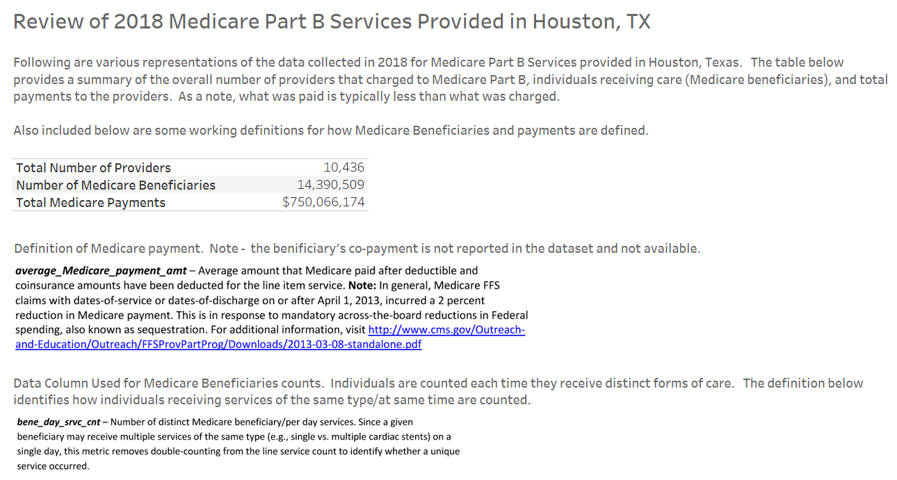
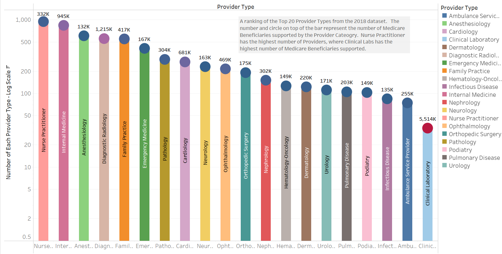
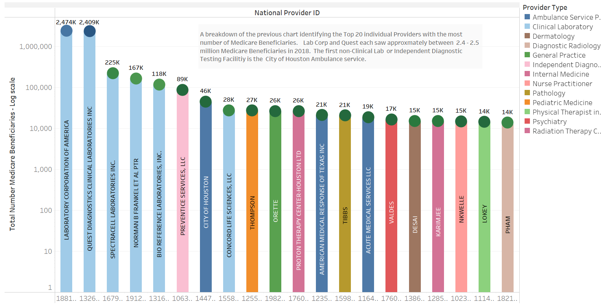
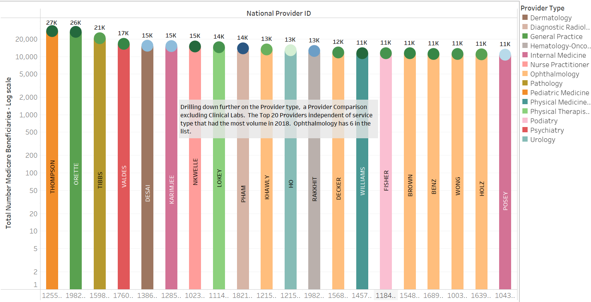
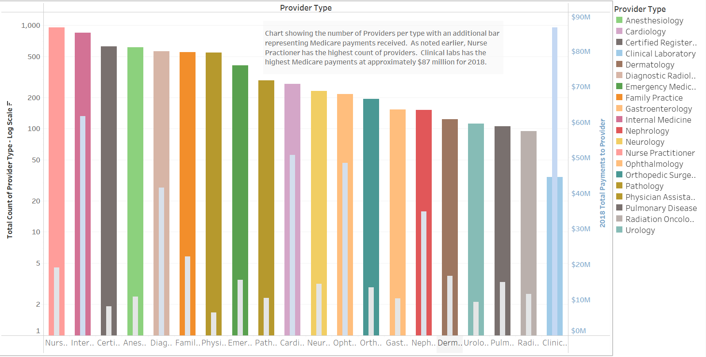
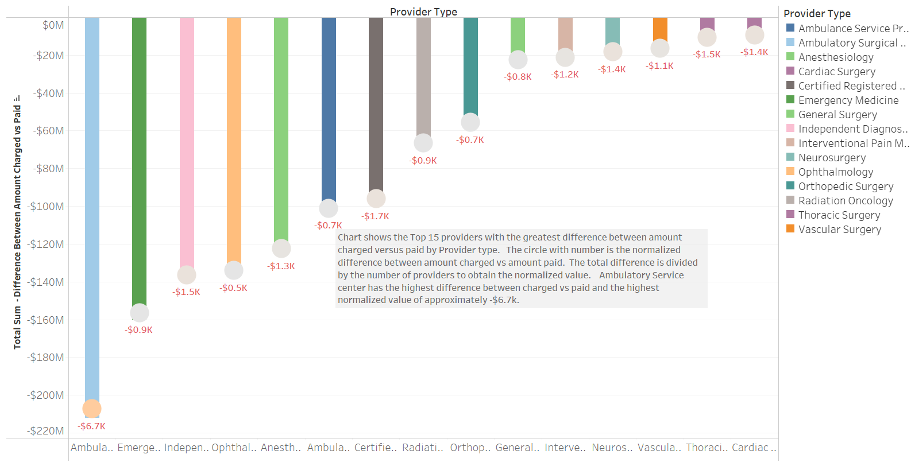
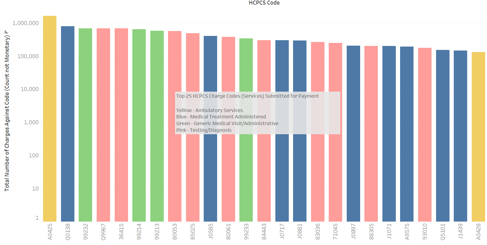
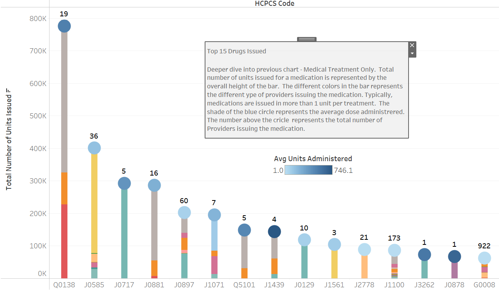

# 2018_Medicare_Part_B_Houston_Analysis
Review and presentation of trends in 2018 Medicare Part B filings from Houston, Texas

Purpose of activity was to evaluate and identify trends associated with services provided under Medicare Part B during the calendar year 2018 in Houston, Texas. 

<u>Brief Medicare overview</u>

Original Medicare is a fee-for-service health plan with a Part A (Hospital Insurance) and a Part B (Medical Insurance).  After a person pays a deductible, Medicare pays its Medicare-approved amount and the patient pays the remainder.  Medicare Part D is drug insurance.  Medicare Advantage Part C is type of Medicare health plan offered by a private company that contracts with Medicare.

The Medicare Part B data was obtained from data.cms.gov, a federal government website managed by the Centers for Medicare & Medicaid Services, 7500 Security Boulevard, Baltimore, MD 21244

Link to data: https://data.cms.gov/Medicare-Physician-Supplier/Medicare-Provider-Utilization-and-Payment-Data-Phy/hczc-ufy5

<u>Data Extraction and Transformation</u>

The original dataset was downloaded as a csv file and it contained information from all locations providing Medicare Part B services in 2018.  The file size was approximately 2.2 GB and was to large to be effectively manage using a spreadsheet.  Python in Jupyter Notebook was used to amend column titles and create a subset of data containing only records of services provided in Houston, Texas.  The Houston only dataframe was exported to a csv file which could then be used to create charts for analysis in Tableau.

<u>Data Review</u>

Link to Tableau: https://public.tableau.com/views/medicare_Houston_CY2018/Story1?:language=en-US&publish=yes&:display_count=n&:origin=viz_share_link

Overall Statistics  

The total number of providers (discrete charging locations) is 10,436.  This number includes Clinical Laboratories that provide a wide range of services and specialty doctor's offices. 
 
The number of individuals that recieved different types of care was 14,390,509. An individual would get counted each time they received a different typr of care such as vaccine, eye exam, etc.  As noted below in the snip, a person (distinct Medicare Beneficiary) receiving multiple cardiac stints in a day would be counted as 1 to remove double-counting.  
 
The total Medicare Part B payments to Houston area providers in 2018 was $750,066,174. 
 

Data Highlights (values are rounded for reporting ease)

 

The Top 5 Medical Provider Types by number of providers are:

Nurse Practitioners with 959 providers identified in the data set supporting 332,000 patients.  Note - Nurse Practitioners were not broken out by specialty in the raw data set.  They were included becuase of the total number responsible for providing care and the total number of patients supported.

Internal Medicine with 848 providers identified supporting 945,000 patients.

Anesthesiology with 613 providers identified supporting 132,000 patients.

Diagnostic Radiology with 562 providers supporting 1,215,000 patients.

Family Practice with 555 providers supporting 417,000 patients.

 
 

The Top 5 Medical Provider Types by number of patients supported are:

Clinical Laboratories - 5,514,000 patients supported

Diagnostic Radiology - 1,215,000 patients supported.

Internal Medicine - 945,000 patients supported.

Cardiology - 681,000 patients supported.

Ophthalmology - 469,000 patients supported.

 
 

The Top 5 Receiving Medicare Part B payments

Clinical Laboratories - $87M

Internal Medicine  - $62M

Cardiology - $51M

Ophthalmology - $49

Diagnostic Radiology - $42M

 
 

The top 15 medications by units administered are:

Ferumoxytol to treat iron-deficiency anemia.

Onabotulinumtoxina to control muscle spasms and reduce wrinkles.

Certolizumab Pegol to reduce pain and swelling due to specific inflammatory conditions.

Darbepoetin Alfa to treat anemia in individuals with chronic kidney failure.

Denosumab to offset bone loss in cancer patients resulting from treatment.

Testosterone Cypionate to address testosterone deficiency.

Filgrastim used in individulas with chronic neutropenia, to prepare blood for leukapheresis or for individuals undergoing bone marrow transplants.

Ferric Carboxymaltose to treat iron-deficiency anemia.

Abatacept is used to reduce pain, swelling and other issues associated with rheumatoid arthritis.

Immune Globulin is blood collected from many individuals that is adminstered to reduce severity of certain infections in at risk patients.

Ranibizumab is used to treat certain serious eye condicitons.

Dexmathasone Sodium Phosphate is used the treat inflammation associated with many different disorders.

Tocilizumab is used for certainb types of arthritis treatment.

Daptomycin is used to treat certain blood or serious skin infections.

Influenza virus vaccine.

Link to Tableau with additonal charts and data: https://public.tableau.com/app/profile/troy.youngblood/viz/medicare_Houston_CY2018/Story1?publish=yes

 
 

Snips of Data Review

 
 
 

Data presenting top providers by general category. The bar height is the number of providers and the circle at the top is the number of patients supported by the provider.  The color of the circle represents the range of patients supported.  The higher the number of patients supported, the color changes from blue, to purple, and finally to red

 
 
 

Data presenting top providers by business.  The bar height and circle at the top provide graphical and numerical values of the number of patients supported.  The color of the bar correlates to the general category of provider. The color of the circle represents the range of patients supported.  The higher the number of patients supported, the color changes from green, to dark green purple, and finally to blue.

 
 
 

Data presenting top providers by business, excluding clinical laboratories.  The bar height and circle at the top provide graphical and numerical values of the number of patients supported.  The color of the bar correlates to the general category of provider.

 
 
 

Data presenting top number of providers by category (outer bar).  The light blue inner bar represents the total payments made to the provider cateogry in 2018.

 
 
 
 

Data presenting the provider category that has the greatest delta between charges and payments received.  The length of the bar represents the sum of the deltas of all the charges and the value in the circle represents the average delta.

 
 
 

Data presenting the Medicare Part B code with the highest count of charge references. The color of the bar represents the type of service conducted by the code.

 
 
 

Data presenting the top 15 drugs issued under Medicare Part B in Houston for the calendar year 2018.  The number at the top of the circle represents the number of providers issuing the drug.  The color of the circle at the top of the bar is a color presentation of the average number of units issues.  The darker the blue, the higher the average number of units issued.  The color of the bar correlates to the cateogry of provider issuing the drug.

 
 
 
